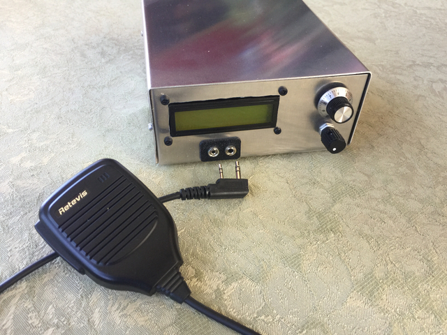
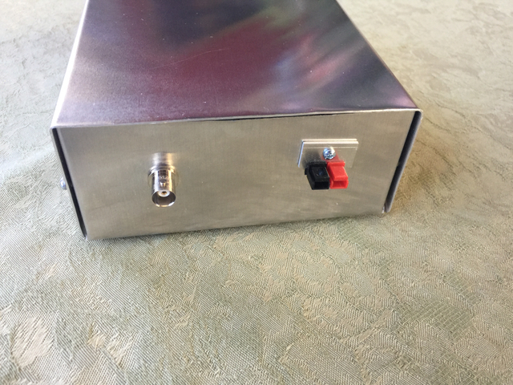
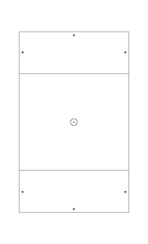
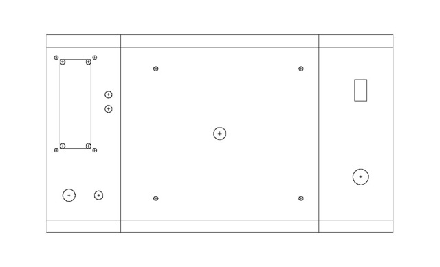
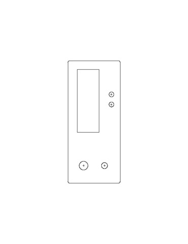

# projectbox-layout
Python program for generating DXF (autocad) files for BitX40 project

  

## Description
The python executable file, ProjectBox.py,  generates a set of 3 DXF (AutoCAD drawing files) that can be used for making your own BitX 40 project box.  The BitX40 is a two-board, 40 meter SSB transceiver produced by HFsignals - more information can be found at http://hfsigs.com. 

The project box template was inspiried by Kiran VU2XE's project box and CAD files design.  The executable allows easy modification and extension of the enclosure design for other projects as well.  

The three template file are:
* pb_top.dxf - Template for Top Sheet 
* pb_bottom.dxf - Template for Bottom Sheet
* pb_front.dxf - Template for the Front Panel (can be used for cutting a separate front panel using a laser cutter)

  

## Use
* use a text file to edit and modify the settings in the ProjectBox.py file (units are in millimeters)
* run "./ProjectBox.py"
* Open generated DXF files using LibreCAD (can be used to export pdf files)
  
## Installation (Ubuntu or other Linux distribution) 
* Download the github repository in a suitable directory.
* Install dxfwrite python library "pip install dxfwrite" 

## Project Box Specs

### Dimensions
* Height 60 mm 
* Width 140 mm
* Depth 160 mm
* Tab Size 10 mm

### Openings
* LCD - 16x2 with 4 mounting holes
* Volume and Tuning Potentimeters
* Kenwood-style 2 pin Mic/Speaker/PTT jacs (2.5mm and 3.5mm audio stereo jacks, 11.5mm spacing)
* BNC antenna connector
* Anderson PowerPole 

### Mounting Holes
* (Bottom) BitX PCB 4 mounting holes 
* (Top) 6 x Case mounting holes

## Project Box Contruction
To make the project box out of metal sheets, you'll need a metal brake (bender).  In the U.S., there's an inexpensive one available (18") from Harbor Freight for low cost.  You can use thin metal sheets, either aluminum or steel.  A low-cost option are  12"x12" galvanized steel flashing sheets - usually available for under $1 USD.  You can also buy 5052 Aluminum Sheets (recommend 0.040 inch thickness). 
To cut the holes, you need a drill, nibbler (for the square holes), or scroll saw. 
